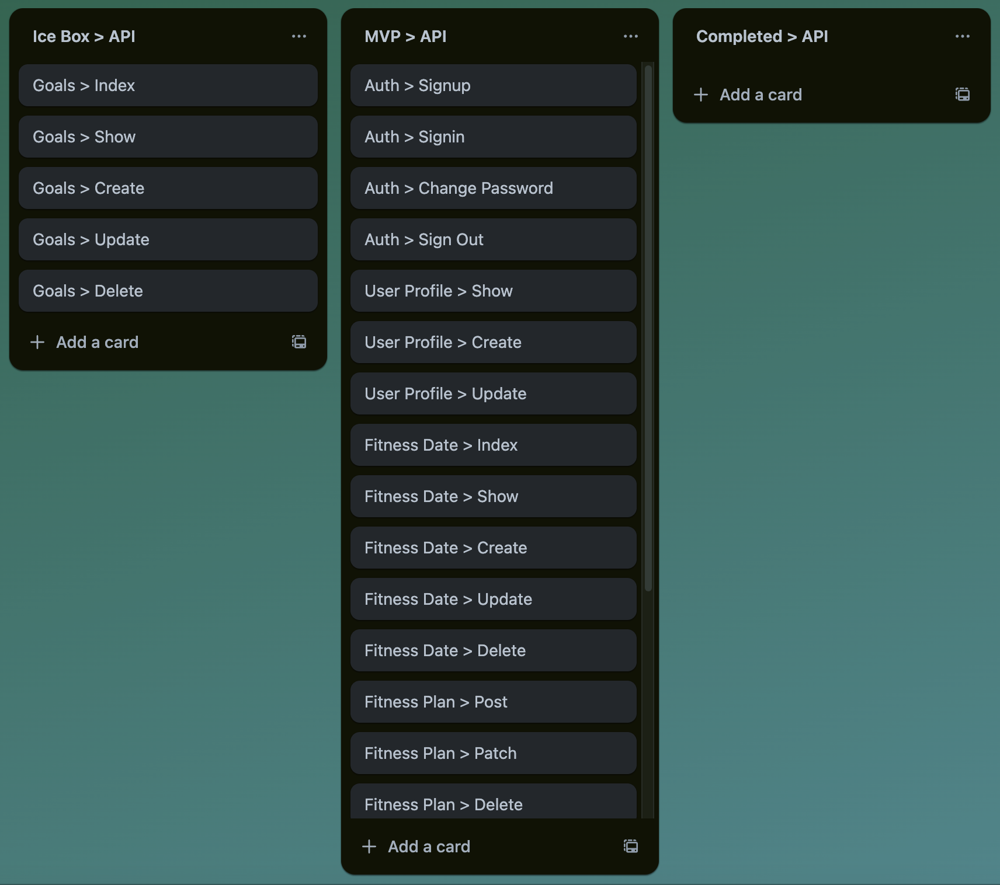
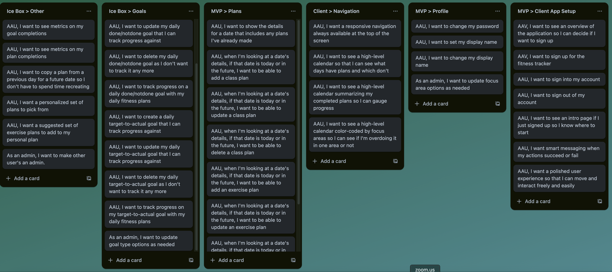
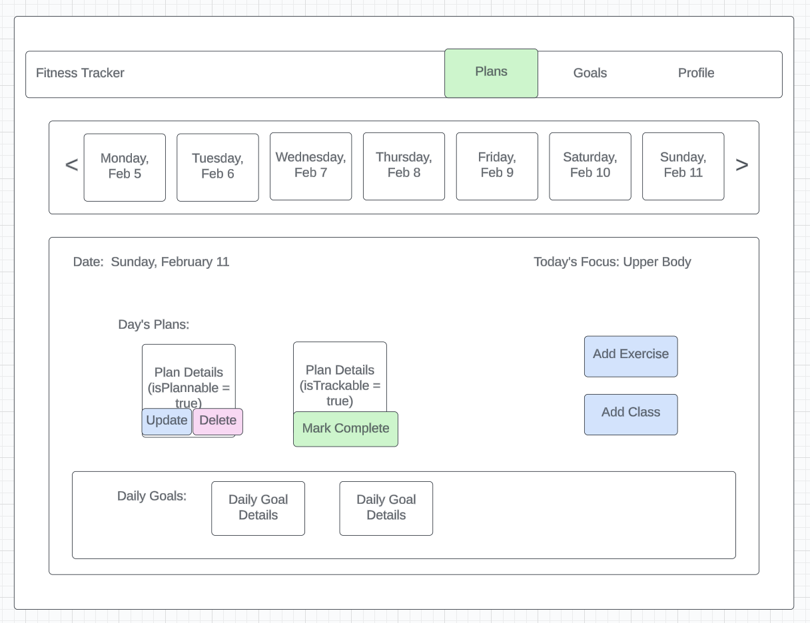
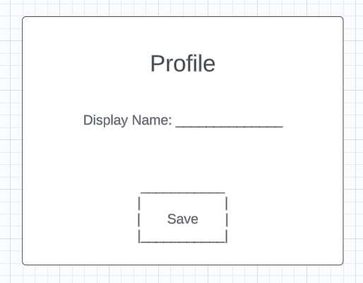
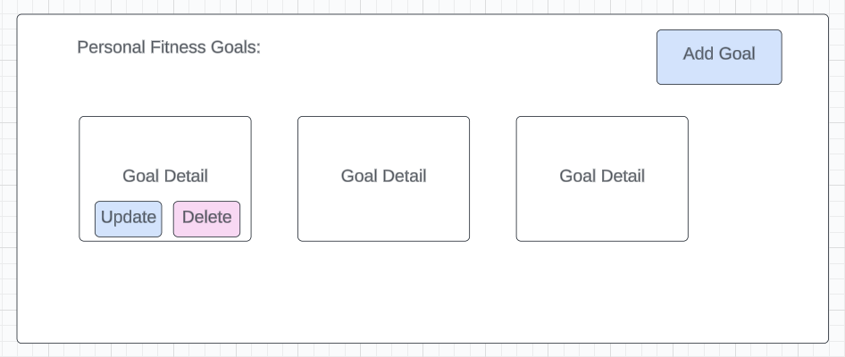
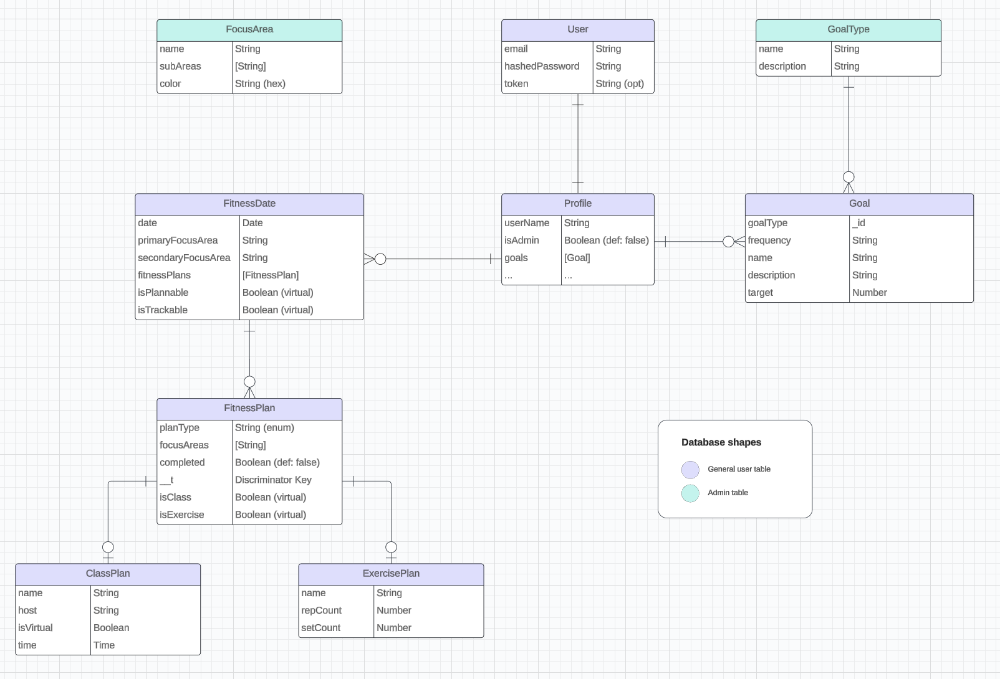

# Fitness Planner

This application will help you with your fitness goals - let you plan your days by adding classes or exercises that focus on strength, cardio, core, or recovery training!  You'll also be able to add goals to march towards to help you stay focused on your "better you" journey!

## User Stories

### API

Trello board for managing API functionality:



### Client

Trello board for managing client application user stories:



## Wireframes

Main "Show" page with navigation bar and calendar navigation



Modals to Add, Update, and Delete Exercise and Class Fitness Plans


User Profile Screen



Personal Fitness Goals Index Page



## ERD




### Discriminators

MongoDB provides discriminators to enable schema inheritance and to model object-oriented inheritance.

I plan to use discriminators in the implementation of `FitnessPlan`, `ClassPlan`, and `ExercisePlan`.

In OOP terms, these resources would be organized as follows:

```js
class FitnessPlan {
    ...
}

class ClassPlan extends FitnessPlan {
    ...
}

class ExercisePlan extends FitnessPlan {
    ...
}
```

In MongoDB, using discriminators for...

#### Models

```js
// General FitnessPlan
const fitnessPlanSchema = new mongoose.Schema(
    {
        ... // common attributes
    }
    , {
        timestamps: true,
        toObject: { virtuals: true },
        toJSON: { virtuals: true },
        discriminatorKey: 'kind',
    }
);
const FitnessPlan = mongoose.model('FitnessPlan', fitnessPlanSchema);

// ClassPlan is a special type of FitnessPlan with class name, time, location, etc. details
const ClassPlan = FitnessPlan.discriminator('ClassPlan',
  new mongoose.Schema({
        // class name
        // class host
        // class location
        ... // other class-specific attributes
    }
    , {
        timestamps: true,
        toObject: { virtuals: true },
        toJSON: { virtuals: true },
        discriminatorKey: 'kind',
    }
));

// likewise for Exercise Plan...
```

All of these entities will be stored in one collection in the database as sub-documents on `FitnessDate`

#### CRUDing

When using these models in Create and Update, I will need separate routes for each model as they have different fields.

I should be able to have one Delete route as I'm just deleting by ID, but I'll use Postman to test that theory out.  Worse case, I create two routes.

When reading, I plan to retrieve all `FitnessPlan` at once (irrespective of type) and use the `discriminatorKey` (set on creation) or virtuals to distinguish `ClassPlan` from `ExercisePlan` so the show pages can be rendered appropriately


#### Sources of info on discriminators

Mongoose Docs: https://mongoosejs.com/docs/discriminators.html

Other Site: https://techinsights.manisuec.com/mongodb/mongoose-discriminator-non-dry-way-inherit-properties/


#### Fallback Options

If I cannot get discriminators to work as expected, my second option is to store the `ClassPlan` and `ExercisePlan` as a sub-document on `FitnessPlan`.  They would both have to be nullable as a `FitnessPlan` will only have one or the other.

The third option is to eliminate `FitnessPlan` altogether and store a collection of `ClassPlan` directly on `FitnessDate` as well as a collection of `ExercisePlan` on `FitnessDate`.  This is not DRY as the common attributes would need to be on both `ClassPlan` and `ExercisePlan` but it would work.