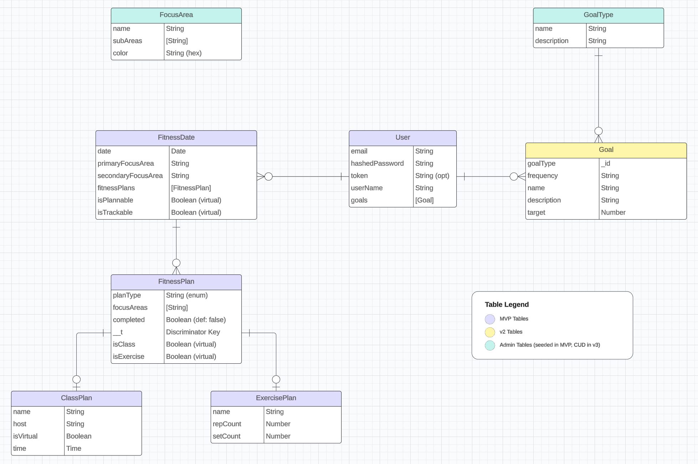

# Fitness Planner

This application will help you with your fitness goals - let you plan your days by adding classes or exercises that focus on strength, cardio, core, or recovery training!  You'll also be able to add goals to march towards to help you stay focused on your "better you" journey!

## User Stories

### API

Trello board for managing API functionality:

### Client

Trello board for managing client application user stories:

## Wireframes

Main "Show" page with navigation bar and calendar navigation

Modals to Add, Update, and Delete Exercise and Class Fitness Plans

User Profile Screen

Personal Fitness Goals Index Page

## ERD

